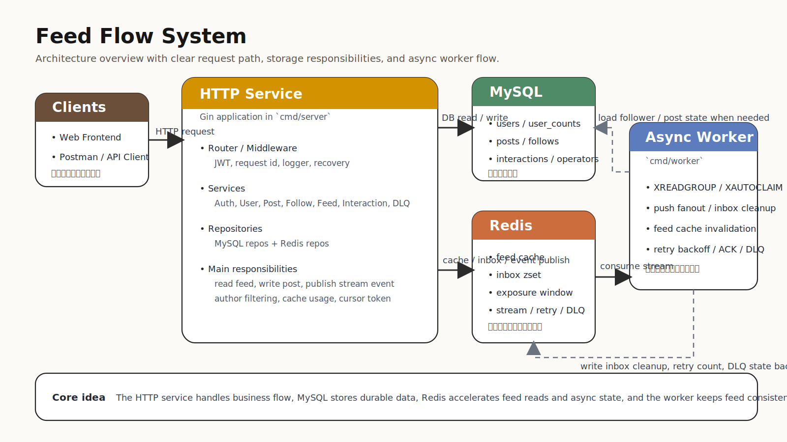
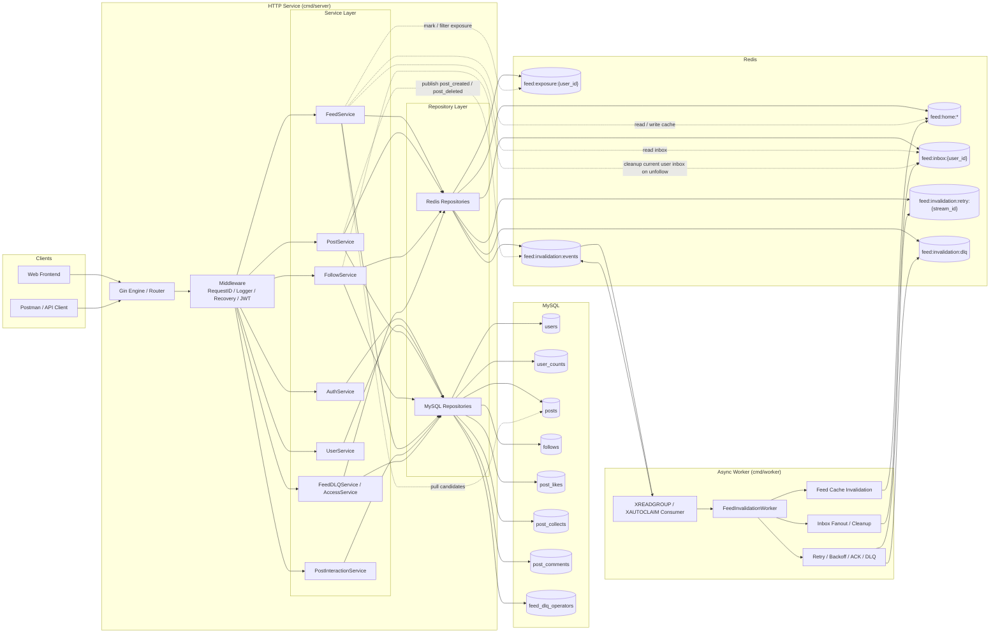
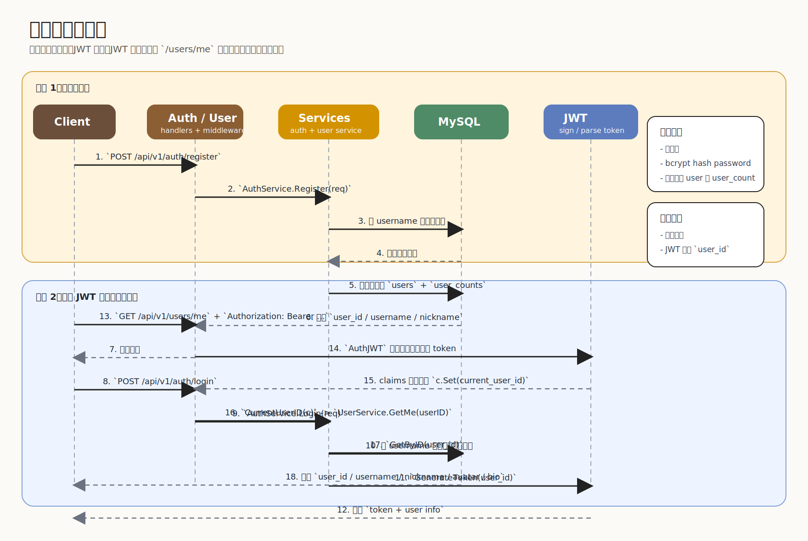
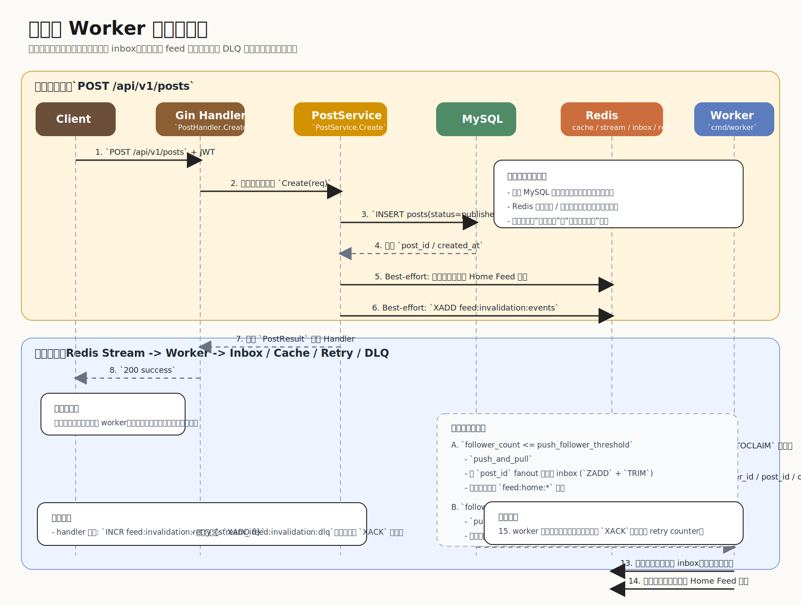
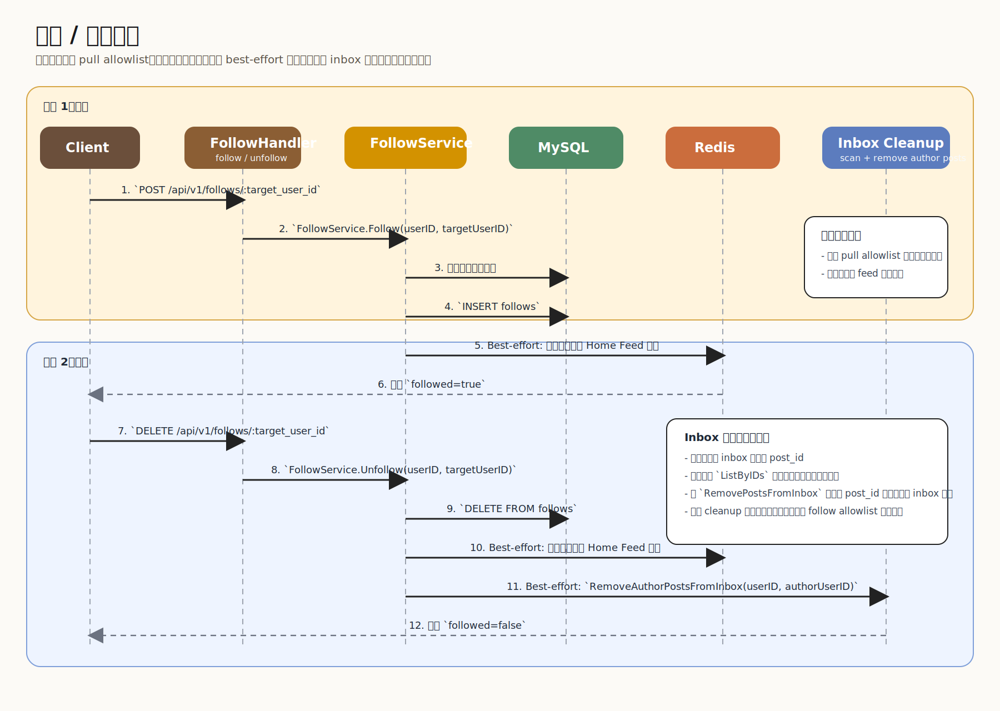
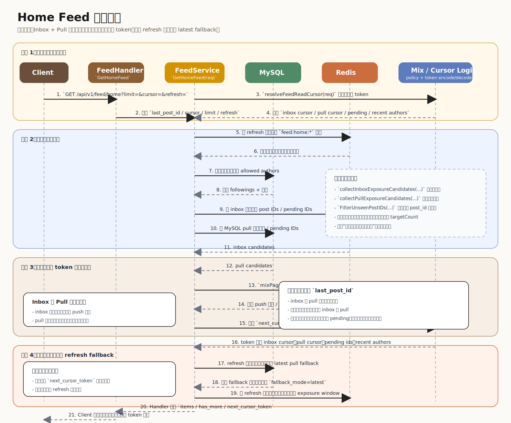
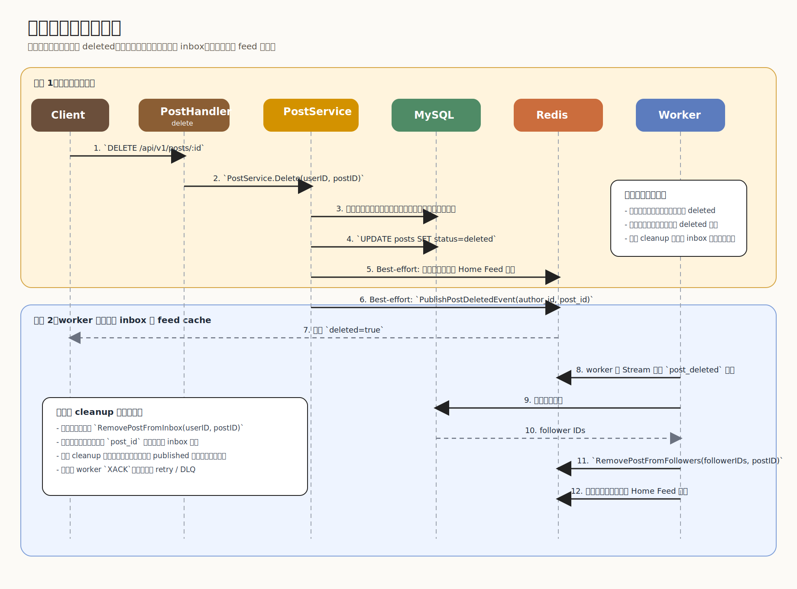
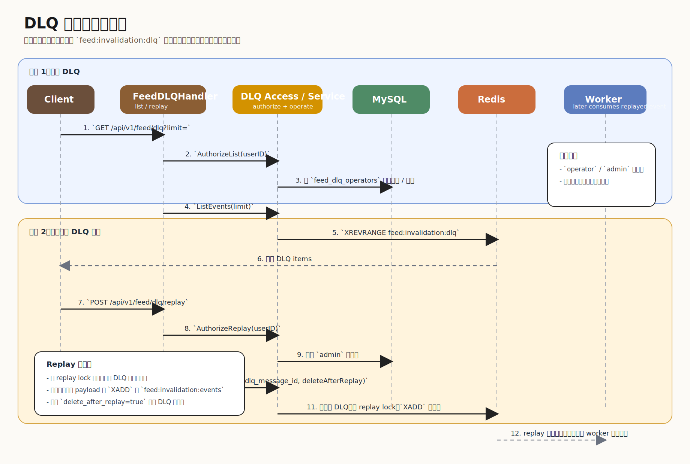

# 架构与核心链路

本文档聚焦项目里的几条核心主链路，适合：

- 自己复盘
- 给协作者快速建立全局认知
- 作为后续功能迭代时的统一背景说明

## 0. 总体架构图

上图是当前系统的图片版总览，适合直接在浏览器或仓库页面中查看。

如果你想看保留更多模块细节的版本，可以再打开 `docs/assets/feed-architecture-overview-detailed.svg`。

如果你想继续维护文字版结构定义，下面仍保留 Mermaid 源码：

## 1. 整体架构

系统可以分成 5 层：

1. Handler 层
2. Service 层
3. Repository 层
4. MySQL
5. Redis

### MySQL 承担

- 用户
- 帖子
- 关注关系
- 点赞 / 收藏 / 评论
- DLQ 操作员表

### Redis 承担

- Feed 缓存
- 用户 inbox
- 曝光去重窗口
- Redis Stream 事件总线
- retry 计数器
- DLQ stream

## 1.1 鉴权链路

下图覆盖注册、登录、JWT 发放，以及携带 JWT 访问 `/users/me` 的链路：

### 对应代码入口

1. 注册入口：[internal/handler/auth_handler.go:31](D:/Golang%20learning/feed-flow-system/internal/handler/auth_handler.go:31)
2. 登录入口：[internal/handler/auth_handler.go:51](D:/Golang%20learning/feed-flow-system/internal/handler/auth_handler.go:51)
3. 注册主流程：[internal/service/auth_service.go:72](D:/Golang%20learning/feed-flow-system/internal/service/auth_service.go:72)
4. 登录主流程：[internal/service/auth_service.go:136](D:/Golang%20learning/feed-flow-system/internal/service/auth_service.go:136)
5. 查用户名：[internal/repository/user_repository.go:19](D:/Golang%20learning/feed-flow-system/internal/repository/user_repository.go:19)
6. 创建用户：[internal/repository/user_repository.go:66](D:/Golang%20learning/feed-flow-system/internal/repository/user_repository.go:66)
7. 初始化 user_count：[internal/repository/user_count_repository.go:17](D:/Golang%20learning/feed-flow-system/internal/repository/user_count_repository.go:17)
8. 生成 JWT：[internal/pkg/jwt/jwt.go:54](D:/Golang%20learning/feed-flow-system/internal/pkg/jwt/jwt.go:54)
9. JWT 中间件：[internal/middleware/auth_jwt.go:21](D:/Golang%20learning/feed-flow-system/internal/middleware/auth_jwt.go:21)
10. 解析 JWT：[internal/pkg/jwt/jwt.go:79](D:/Golang%20learning/feed-flow-system/internal/pkg/jwt/jwt.go:79)
11. 获取当前用户 ID：[internal/middleware/auth_jwt.go:78](D:/Golang%20learning/feed-flow-system/internal/middleware/auth_jwt.go:78)
12. `/users/me` 入口：[internal/handler/user_handler.go:24](D:/Golang%20learning/feed-flow-system/internal/handler/user_handler.go:24)
13. `GetMe` 读取用户信息：[internal/service/user_service.go:120](D:/Golang%20learning/feed-flow-system/internal/service/user_service.go:120)
14. 按 ID 查用户：[internal/repository/user_repository.go:33](D:/Golang%20learning/feed-flow-system/internal/repository/user_repository.go:33)

## 2. 写路径：发帖

### 同步主链路

1. 用户请求 `POST /api/v1/posts`
2. Handler 校验登录态与参数
3. `PostService.Create(...)` 写入 MySQL `posts`
4. Best-effort 失效作者自己的 Home Feed 缓存
5. Best-effort 发布 Redis Stream 事件
6. 返回发帖成功

这里有一个重要设计：

- 发帖成功不依赖 Redis 事件一定成功
- Redis 故障时，帖子依然能落库
- 这符合“核心写入以 DB 为准，异步增强能力尽量不阻塞主链路”的思路

## 3. 异步链路：发帖事件 -> worker

帖子创建后，会向 Redis Stream 写入：

- stream: `feed:invalidation:events`

事件字段包括：

- `type`
- `author_id`
- `post_id`
- `occurred_at`

worker 消费流程：

1. `XREADGROUP` 读取新消息
2. `XAUTOCLAIM` 回收其他 consumer 崩溃留下的 pending
3. 按作者粉丝数决定 `push_and_pull` 或 `pull_only`
4. 如果是小作者并且开启 inbox：
   - fanout 到粉丝 inbox
5. 无论 push / pull：
   - 失效粉丝 feed 缓存
6. 成功后 `XACK`
7. 失败则增加 retry 计数
8. 达到上限后写入 DLQ，再 ACK 原消息

下图把“同步发帖成功返回”和“后台 worker 继续补一致性”分开画出来了：

### 对应代码入口

1. 请求入口：[internal/handler/post_handler.go:27](D:/Golang%20learning/feed-flow-system/internal/handler/post_handler.go:27)
2. 发帖主流程：[internal/service/post_service.go:76](D:/Golang%20learning/feed-flow-system/internal/service/post_service.go:76)
3. 帖子落库：[internal/repository/post_repository.go:18](D:/Golang%20learning/feed-flow-system/internal/repository/post_repository.go:18)
4. 发布发帖事件：[internal/repository/feed_invalidation_event_repository.go:168](D:/Golang%20learning/feed-flow-system/internal/repository/feed_invalidation_event_repository.go:168)
5. worker 启动入口：[cmd/worker/main.go:24](D:/Golang%20learning/feed-flow-system/cmd/worker/main.go:24)
6. worker 消费循环：[internal/repository/feed_invalidation_event_repository.go:212](D:/Golang%20learning/feed-flow-system/internal/repository/feed_invalidation_event_repository.go:212)
7. worker 发帖事件处理：[internal/service/feed_invalidation_worker.go:78](D:/Golang%20learning/feed-flow-system/internal/service/feed_invalidation_worker.go:78)
8. 查询粉丝列表：[internal/repository/follow_repository.go:66](D:/Golang%20learning/feed-flow-system/internal/repository/follow_repository.go:66)
9. inbox fanout：[internal/service/feed_inbox_fanout.go:71](D:/Golang%20learning/feed-flow-system/internal/service/feed_inbox_fanout.go:71)
10. 写入 inbox：[internal/repository/feed_inbox_repository.go:28](D:/Golang%20learning/feed-flow-system/internal/repository/feed_inbox_repository.go:28)
11. inbox trim：[internal/repository/feed_inbox_repository.go:82](D:/Golang%20learning/feed-flow-system/internal/repository/feed_inbox_repository.go:82)

## 4. Feed V1：纯 Pull

最基础读取方式：

1. 查当前用户关注列表
2. 把自己也放入允许作者集合
3. 按 `post_id desc` 从 MySQL 拉帖子
4. `limit+1` 判断 `has_more`

优点：

- 简单直接
- 一致性好理解

缺点：

- 读压力更集中在 DB
- 无法体现 Feed 系统里更有意思的工程能力

## 5. Feed V2：推拉混合

### Push / Pull 分流

当前规则：

- 作者粉丝数 `<= push_follower_threshold`
  - `push_and_pull`
- 作者粉丝数 `> push_follower_threshold`
  - `pull_only`

设计目的：

- 小作者粉丝少，push 成本可控，读性能更好
- 大作者粉丝多，避免写扩散过大

### Inbox 结构

Redis ZSET：

- key: `feed:inbox:{user_id}`
- member: `post_id`
- score: `occurred_at`

为什么选 ZSET：

- 天然支持按时间排序
- 支持 trim，限制单用户 inbox 长度
- 能直接按倒序读取最新内容

## 5.1 关注与取关

下图覆盖 follow / unfollow 如何影响 Feed：

### 对应代码入口

1. follow 入口：[internal/handler/follow_handler.go:24](D:/Golang%20learning/feed-flow-system/internal/handler/follow_handler.go:24)
2. unfollow 入口：[internal/handler/follow_handler.go:45](D:/Golang%20learning/feed-flow-system/internal/handler/follow_handler.go:45)
3. follow 主流程：[internal/service/follow_service.go:55](D:/Golang%20learning/feed-flow-system/internal/service/follow_service.go:55)
4. unfollow 主流程：[internal/service/follow_service.go:88](D:/Golang%20learning/feed-flow-system/internal/service/follow_service.go:88)
5. 创建 follow 关系：[internal/repository/follow_repository.go:18](D:/Golang%20learning/feed-flow-system/internal/repository/follow_repository.go:18)
6. 删除 follow 关系：[internal/repository/follow_repository.go:22](D:/Golang%20learning/feed-flow-system/internal/repository/follow_repository.go:22)
7. 失效 feed 缓存：[internal/repository/feed_cache_invalidator_repository.go:19](D:/Golang%20learning/feed-flow-system/internal/repository/feed_cache_invalidator_repository.go:19)
8. 取关后的 inbox 作者清理：[internal/service/feed_inbox_author_cleanup.go:57](D:/Golang%20learning/feed-flow-system/internal/service/feed_inbox_author_cleanup.go:57)
9. inbox 扫描 post IDs：[internal/repository/feed_inbox_repository.go:161](D:/Golang%20learning/feed-flow-system/internal/repository/feed_inbox_repository.go:161)
10. 回表找作者帖子：[internal/repository/post_repository.go:118](D:/Golang%20learning/feed-flow-system/internal/repository/post_repository.go:118)
11. 从 inbox 删除一批帖子：[internal/repository/feed_inbox_repository.go:55](D:/Golang%20learning/feed-flow-system/internal/repository/feed_inbox_repository.go:55)

## 6. Home Feed 读路径

Home Feed 的读取逻辑不是单一路径，而是带降级和策略叠加的：

1. 先解析请求参数
2. 如果命中 feed 缓存，直接返回
3. 构造允许作者集合
4. 读取 inbox 候选和 pull 候选
5. 如开启 exposure，对候选做“近期已曝光去重”
6. 进入混排策略
7. 产出：
   - `items`
   - `has_more`
   - `next_cursor_token`
8. 结果写缓存
9. 将本次返回的帖子标记为已曝光

下图对应当前 `GetHomeFeed` 的真实读取流程：

### 对应代码入口

1. 请求入口：[internal/handler/feed_handler.go:24](D:/Golang%20learning/feed-flow-system/internal/handler/feed_handler.go:24)
2. Feed 主流程：[internal/service/feed_service.go:106](D:/Golang%20learning/feed-flow-system/internal/service/feed_service.go:106)
3. 解析 cursor token：[internal/service/feed_cursor.go:56](D:/Golang%20learning/feed-flow-system/internal/service/feed_cursor.go:56)
4. 编码 next cursor token：[internal/service/feed_cursor.go:32](D:/Golang%20learning/feed-flow-system/internal/service/feed_cursor.go:32)
5. 查询关注作者：[internal/repository/follow_repository.go:28](D:/Golang%20learning/feed-flow-system/internal/repository/follow_repository.go:28)
6. Pull 候选收集：[internal/service/feed_exposure.go:58](D:/Golang%20learning/feed-flow-system/internal/service/feed_exposure.go:58)
7. Inbox 候选收集：[internal/service/feed_exposure.go:123](D:/Golang%20learning/feed-flow-system/internal/service/feed_exposure.go:123)
8. Pull 查询帖子：[internal/repository/post_repository.go:47](D:/Golang%20learning/feed-flow-system/internal/repository/post_repository.go:47)
9. Inbox post_id 回表：[internal/repository/post_repository.go:118](D:/Golang%20learning/feed-flow-system/internal/repository/post_repository.go:118)
10. 曝光过滤：[internal/repository/feed_exposure_repository.go:38](D:/Golang%20learning/feed-flow-system/internal/repository/feed_exposure_repository.go:38)
11. 混排主逻辑：[internal/service/feed_mix_strategy.go:123](D:/Golang%20learning/feed-flow-system/internal/service/feed_mix_strategy.go:123)
12. 混排选点规则：[internal/service/feed_mix_strategy.go:463](D:/Golang%20learning/feed-flow-system/internal/service/feed_mix_strategy.go:463)
13. refresh 空页 fallback：[internal/service/feed_service.go:304](D:/Golang%20learning/feed-flow-system/internal/service/feed_service.go:304)
14. 曝光写回：[internal/service/feed_exposure.go:249](D:/Golang%20learning/feed-flow-system/internal/service/feed_exposure.go:249)
15. 曝光窗口写入 Redis：[internal/repository/feed_exposure_repository.go:106](D:/Golang%20learning/feed-flow-system/internal/repository/feed_exposure_repository.go:106)

## 7. 为什么不能只用一个 `last_post_id`

因为混排里存在这些情况：

- inbox 和 pull 各自游标不同
- 同一帖子可能同时出现在 inbox 和 pull
- pull 保底会让某些帖子暂时不返回
- pending 候选要带到下一页继续参与混排

如果只记录一个 `last_post_id`，会有两类问题：

- 重复
- 漏刷

所以当前方案使用：

- inbox cursor
- pull cursor
- inbox pending ids
- pull pending ids
- recent author ids

这些状态被统一编码进 `next_cursor_token`。

## 8. 混排策略

当前混排重点不是“复杂推荐”，而是“可解释”：

- push 配额
- pull 保底
- 同作者连续限制
- 作者冷却窗口
- 来源连续限制
- 跨页作者限流

具体来说：

### Push 配额

控制一页里 inbox 来源理论上最多占多少。

### Pull 保底

即使 inbox 很丰富，也至少给 pull 留一些坑位，保证大作者内容能露出。

### 作者打散

避免同一作者连续刷屏。

### 跨页作者限流

第一页尾部和第二页开头共享最近作者历史，避免翻页后打散立即失效。

## 9. 曝光去重

用户看到过的帖子会写入：

- `feed:exposure:{user_id}`

读取 Feed 时：

1. 先 trim 掉过期曝光记录
2. 过滤候选里已经曝光过的 `post_id`
3. 如果过滤太狠，继续补拉更多候选

作用：

- 减少刷新后重复看到同一帖子
- 提升“新鲜感”

## 10. 删帖与取关一致性

### 删帖

删帖后：

1. 主流程把帖子状态设为已删除
2. 事件进入 worker
3. worker 清理粉丝 inbox 中该 `post_id`
4. worker 失效相关 feed cache
5. 读路径本身也只返回 `status=published` 的帖子

所以即使异步 cleanup 延迟，读路径仍能兜底跳过已删帖。

下图把删帖主流程和异步清理拆开画出来了：

### 对应代码入口

1. 删帖入口：[internal/handler/post_handler.go:52](D:/Golang%20learning/feed-flow-system/internal/handler/post_handler.go:52)
2. 删帖主流程：[internal/service/post_service.go:114](D:/Golang%20learning/feed-flow-system/internal/service/post_service.go:114)
3. 软删除帖子：[internal/repository/post_repository.go:35](D:/Golang%20learning/feed-flow-system/internal/repository/post_repository.go:35)
4. 发布删帖事件：[internal/repository/feed_invalidation_event_repository.go:172](D:/Golang%20learning/feed-flow-system/internal/repository/feed_invalidation_event_repository.go:172)
5. worker 删除事件处理：[internal/service/feed_invalidation_worker.go:82](D:/Golang%20learning/feed-flow-system/internal/service/feed_invalidation_worker.go:82)
6. 删除型 inbox cleanup：[internal/service/feed_inbox_cleanup.go:57](D:/Golang%20learning/feed-flow-system/internal/service/feed_inbox_cleanup.go:57)
7. 从单个 inbox 删除帖子：[internal/repository/feed_inbox_repository.go:47](D:/Golang%20learning/feed-flow-system/internal/repository/feed_inbox_repository.go:47)
8. 批量删除多个 inbox 的帖子：[internal/repository/feed_inbox_repository.go:136](D:/Golang%20learning/feed-flow-system/internal/repository/feed_inbox_repository.go:136)

### 取关

取关后：

1. DB 中删除 follow 关系
2. Best-effort 失效当前用户 feed cache
3. Best-effort 清理当前用户 inbox 中该作者历史帖子
4. 读路径还会根据最新 follow allowlist 过滤作者

因此：

- cleanup 负责“让存储更干净”
- 读过滤负责“让结果一定正确”

## 11. 可靠性补强

### XAUTOCLAIM

解决场景：

- 某个 consumer 拿到消息但进程崩溃
- 消息会停留在 pending

做法：

- 新 consumer 定期 `XAUTOCLAIM`
- 接管超时未处理的 pending

### 指数退避

解决场景：

- Redis 瞬时抖动
- worker 不应该直接退出

做法：

- 消费循环外层带 retry
- backoff 指数增长
- 引入 jitter，避免多个 worker 同步重试

### DLQ

解决场景：

- 某些消息反复失败，不能无限重试

做法：

- 每条 stream 消息维护 retry 计数
- 达到上限后写入 `feed:invalidation:dlq`
- 原消息 ACK，避免毒消息卡死消费组

下图覆盖 DLQ 查询和单条 replay：

### 对应代码入口

1. DLQ 列表入口：[internal/handler/feed_dlq_handler.go:30](D:/Golang%20learning/feed-flow-system/internal/handler/feed_dlq_handler.go:30)
2. DLQ replay 入口：[internal/handler/feed_dlq_handler.go:67](D:/Golang%20learning/feed-flow-system/internal/handler/feed_dlq_handler.go:67)
3. 列表权限校验：[internal/service/feed_dlq_access_service.go:22](D:/Golang%20learning/feed-flow-system/internal/service/feed_dlq_access_service.go:22)
4. replay 权限校验：[internal/service/feed_dlq_access_service.go:26](D:/Golang%20learning/feed-flow-system/internal/service/feed_dlq_access_service.go:26)
5. 查操作员角色：[internal/repository/feed_dlq_operator_repository.go:19](D:/Golang%20learning/feed-flow-system/internal/repository/feed_dlq_operator_repository.go:19)
6. 列表服务：[internal/service/feed_dlq_service.go:43](D:/Golang%20learning/feed-flow-system/internal/service/feed_dlq_service.go:43)
7. replay 服务：[internal/service/feed_dlq_service.go:66](D:/Golang%20learning/feed-flow-system/internal/service/feed_dlq_service.go:66)
8. 读取 DLQ：[internal/repository/feed_invalidation_event_repository.go:556](D:/Golang%20learning/feed-flow-system/internal/repository/feed_invalidation_event_repository.go:556)
9. 重放 DLQ：[internal/repository/feed_invalidation_event_repository.go:576](D:/Golang%20learning/feed-flow-system/internal/repository/feed_invalidation_event_repository.go:576)

## 12. 推荐理解顺序

可以按下面这条主线理解整个系统：

1. 先有一个纯 Pull 的关注流
2. 然后引入 Push / Pull 混合分发
3. 小作者 fanout 到 inbox，大作者只走 pull
4. 读路径同时读 inbox 和 pull，再做混排
5. 为了解决混排分页的一致性，引入双游标和 pending token
6. 为了提升体验，引入 exposure 去重和作者打散
7. 为了保证异步链路可靠，引入 XAUTOCLAIM、重试退避和 DLQ
